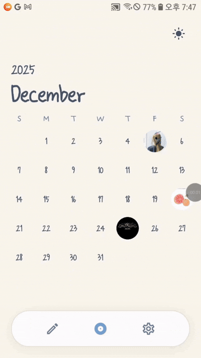
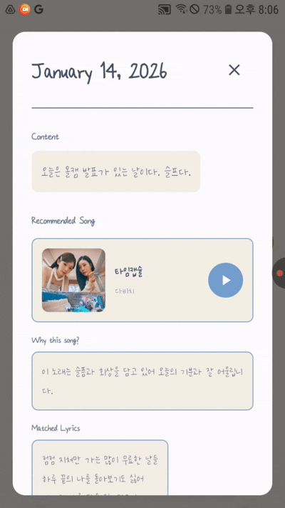
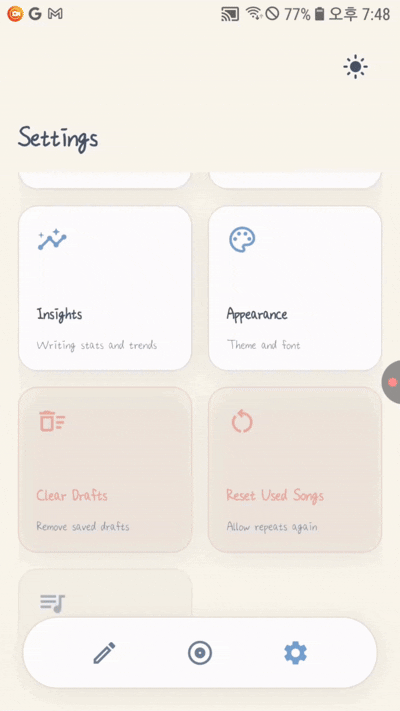

<div style="display: flex; align-items: center;"> 
  
  <h1 style="margin: 0;">Musiclog</h1> 
</div>

> **오늘의 기분에 가장 어울리는 음악 한 곡을 추천하는 감정 기반 음악 앱**

일기는 시간이 지나며 감정과 분위기를 그대로 재현이 어렵다. 이에 Musiclog는 일기 작성 시점의 탑100 음악을 함께 저장하여 텍스트 기록에 시간 맥락을 부여하고 기억 회상을 강화한다.

---

## 👥 팀원

| 이름 | 역할 |
|------|------|
| **[최서영](https://github.com/Osssai-52)** | Backend, AI 추천 시스템, 데이터 관리 |
| **[박지민](https://github.com/xistoh162108)** | Frontend, UI/UX |

---

## ✨ 주요 기능

### 📝 일기 작성 및 저장
- 사용자가 날짜별로 그날의 일기 작성
- 작성된 일기는 기기 내부에 로컬 저장
- 하루 단위로 일기 관리 가능

### 🎧 시점 기반 음악 데이터 연동 및 추천
- 일기 작성 시점의 탑100 음악 데이터 연결
- 일기 텍스트를 분석하여 분위기와 감정 파악
- 일기 내용과 어울리는 음악 추천
- 해당 시점의 음악 트렌드를 일기와 함께 기록

### 📋 일기 리스트 조회
- 날짜 기준으로 정렬된 일기 목록 제공
- 각 일기 카드에 작성 날짜, 일기 내용 미리보기, 추천 음악 정보 표시

### 📅 캘린더 UI 지원
- 일기를 캘린더 형태의 UI로 시각화
- 각 날짜에는 해당 일기에 연결된 앨범 커버 이미지 표시
- 날짜별로 저장된 기록을 한눈에 확인 가능

### 📊 기록 통계 (Insights)
- 월별/주별 일기 작성 개수 통계 제공
- 사용자가 가장 많이 기록한 기간 확인 가능
- Top Artist: 일기와 함께 가장 많이 등장한 아티스트 분석

### ⚙️ 설정
- 🌓 다크/라이트 모드 전환
- 📏 텍스트 크기 조절
- 📤 Markdown/JSON 형식으로 일기 내보내기
- 🔄 사용된 노래 초기화 (중복 추천 허용)

---

## 🛠 사용 기술

| 분류 | 기술 |
|------|------|
| **Framework** | Flutter 3.x, Dart |
| **Local Database** | Hive |
| **AI/ML** | OpenAI Embeddings API |
| **Music API** | Apple Music API |
| **상태 관리** | ValueListenableBuilder, Provider Pattern |
| **UI** | Material Design 3, Custom Theme System |
| **기타** | table_calendar, shared_preferences, share_plus |

---

## 📱 페이지별 기능

| 페이지 | 기능 |
|--------|------|
| **일기 작성 & 리스트 뷰** | 일기 작성 및 조회, 추천 음악 확인 |
| **캘린더 뷰** | 월별 일기 목록, 상세 보기 |
| **Settings** | 데이터 내보내기, 기록 통계, 화면 설정, 기록 관리 |


---

## 📸 스크린샷

<!-- 움짤 4개 이상 또는 20초 이상의 동영상(사진 4장 이상) -->

| 캘린더 뷰 | 일기 작성 |
|:---------:|:---------:|
|  |  |

| 노래 추천 | 인사이트 |
|:---------:|:---------:|
|  |  |

<!-- 또는 동영상 링크 -->
<!-- 📹 [데모 영상 보기](https://youtube.com/your-demo-video) -->

---

## 📥 APK 다운로드

<!-- APK 파일 직접 업로드 또는 구글 드라이브 링크 -->
📦 [APK 다운로드 (Google Drive)](https://drive.google.com/your-apk-link)

또는 [Releases](https://github.com/Osssai-52/Musiclog/releases) 페이지에서 최신 버전을 다운로드하세요.

---

## 🚀 Getting Started

### 사전 요구사항
- Flutter SDK 3.10.4 이상
- Dart SDK
- Android Studio 또는 VS Code

### 설치 및 실행

```bash
# 저장소 클론
git clone https://github.com/Osssai-52/Musiclog.git
cd Musiclog

# 의존성 설치
flutter pub get

# Hive 어댑터 생성
flutter packages pub run build_runner build

# 앱 실행
flutter run
```

### 환경 변수 설정

`lib/constants/strings.dart` 파일에 API 키를 설정하세요:
```dart
class CustomStrings {
  static const clientId = 'YOUR_SPOTIFY_CLIENT_ID';
  static const clientSecret = 'YOUR_SPOTIFY_CLIENT_SECRET';
}
```

---

## 📂 프로젝트 구조

```
lib/
├── main.dart              # 앱 진입점
├── config/                # 테마 및 색상 설정
├── constants/             # 상수 정의
├── data/                  # 데이터 레이어
├── di/                    # 의존성 주입
├── domain/                # 도메인 레이어
│   ├── models/            # 데이터 모델 (DiaryEntry, Song 등)
│   ├── repositories/      # 리포지토리 인터페이스
│   ├── services/          # 서비스 (추천 서비스 등)
│   └── usecases/          # 유스케이스 (RecommendSongUseCase)
├── utils/                 # 유틸리티 함수
└── views/                 # UI 레이어
    ├── calendar_view.dart
    ├── list_view.dart
    ├── insights_view.dart
    ├── settings_view.dart
    └── widgets/           # 재사용 위젯
```

---

## 📄 라이선스

This project is licensed under the MIT License.

